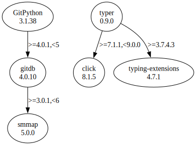

# Third Party Dependencies

<!--[[[fill sbom_sha256()]]]-->
The [SBOM in CycloneDX v1.4 JSON format](https://github.com/sthagen/pilli/blob/default/sbom.json) with SHA256 checksum ([cf197236 ...](https://raw.githubusercontent.com/sthagen/pilli/default/sbom.json.sha256 "sha256:cf197236806d53cd0dfd404e4c6e2adb6bd27de872febd63e7a3e82e3eeec9cd")).
<!--[[[end]]] (checksum: 945d3c8d4ca827f69c45f3df70420463)-->
## Licenses 

JSON files with complete license info of: [direct dependencies](direct-dependency-licenses.json) | [all dependencies](all-dependency-licenses.json)

### Direct Dependencies

<!--[[[fill direct_dependencies_table()]]]-->
| Name                                                           | Version                                              | License     | Author                         | Description (from packaging data)                                    |
|:---------------------------------------------------------------|:-----------------------------------------------------|:------------|:-------------------------------|:---------------------------------------------------------------------|
| [GitPython](https://github.com/gitpython-developers/GitPython) | [3.1.29](https://pypi.org/project/GitPython/3.1.29/) | BSD License | Sebastian Thiel, Michael Trier | GitPython is a python library used to interact with Git repositories |
| [typer](https://github.com/tiangolo/typer)                     | [0.7.0](https://pypi.org/project/typer/0.7.0/)       | MIT License | Sebastián Ramírez              | Typer, build great CLIs. Easy to code. Based on Python type hints.   |
<!--[[[end]]] (checksum: 935fc6c4f6c9be5e45215056793bd908)-->

### Indirect Dependencies

<!--[[[fill indirect_dependencies_table()]]]-->
| Name                                          | Version                                        | License     | Author         | Description (from packaging data)         |
|:----------------------------------------------|:-----------------------------------------------|:------------|:---------------|:------------------------------------------|
| [click](https://palletsprojects.com/p/click/) | [8.1.3](https://pypi.org/project/click/8.1.3/) | BSD License | Armin Ronacher | Composable command line interface toolkit |
<!--[[[end]]] (checksum: dc3a866a7aa3332404bde3da87727cb9)-->

## Dependency Tree(s)

JSON file with the complete package dependency tree info of: [the full dependency tree](package-dependency-tree.json)

### Rendered SVG

Base graphviz file in dot format: [Trees of the direct dependencies](package-dependency-tree.dot.txt)



### Console Representation

<!--[[[fill dependency_tree_console_text()]]]-->
````console
GitPython==3.1.29
  - gitdb [required: >=4.0.1,<5, installed: 4.0.9]
    - smmap [required: >=3.0.1,<6, installed: 5.0.0]
typer==0.7.0
  - click [required: >=7.1.1,<9.0.0, installed: 8.1.3]
````
<!--[[[end]]] (checksum: eb957422a3932d11ba2645e313afbc0f)-->
